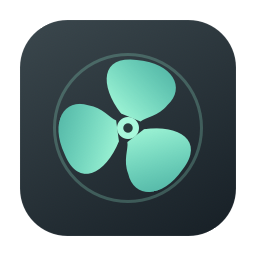

<p align="center"></p>
<h1 align="center">Mac Fan Controller</h1>
<p align="center">Native cooling controls, right in your Mac's menu bar.</p>

SwiftUI screens in an AppKit popover, with no Dock icon. The default is Apple automatic. Optional performance, balanced, quiet, and manual modes use a separate privileged helper. Settings and temperature/RPM history live in a local SQLite database.

- Configurable temperature and fan RPM in the menu bar, including both fans.
- Independent manual sliders or synchronized control relative to each fan's range.
- Performance cooling with temperature curves, bounded trend lookahead, hysteresis, quick ramp-up, and gradual ramp-down.
- Thermal-pressure/high-temperature override, helper heartbeat, and crash-recovery marker.
- Temperature and fan-speed charts; 1, 7, or 30 days of history.
- Launch at login through macOS Service Management.
- App/DMG build tooling, Homebrew cask template, CI, and release workflow.

## Status

**Development alpha.** Targets M2 Pro and M3 Pro MacBook Pros on macOS 26 and 27. These Macs have not yet been available for privileged fan-write testing. Live read-only sensors were verified on a fanless M2 MacBook Air running macOS 27. Native controls and charts were exercised using explicitly simulated fans; 25 core tests cover the controller, helper session recovery, and SQLite.

SMC access is undocumented and can change with firmware/macOS. Fan writes are currently restricted to M2 Pro and M3 Pro. A helper successfully registering does not establish working hardware control. See [control design and hardware validation](docs/CONTROL.md) and [open-source research](docs/SOURCE_RESEARCH.md).

## Build and run

Requires macOS, Xcode or Command Line Tools with Swift 5.9+, and Apple Silicon. The native UI uses APIs available on macOS 13+, while fan-control compatibility targets the machines/OS versions above. No Node, Rust, external Swift package, or network service is required at runtime.

```sh
make test
make build
make dev       # real read-only monitoring; control remains Apple automatic
make demo      # simulated fans, separate demo database, no privileged writes
make probe     # JSON snapshot, no fan writes
make dmg
```

`dist/Mac Fan Controller.app` is the built app. Copy it to `/Applications` before enabling the helper or launch at login. In Settings, choose **Enable helper** and approve it in macOS Login Items & Extensions if prompted. Monitoring does not require an administrator. Every launch and wake defaults to Apple automatic.

Builds are ad-hoc signed by default. For a Developer ID build, set `MFC_SIGN_IDENTITY` to your signing identity; public distribution should also notarize the DMG. No release or tap has been published yet.

## Homebrew

The release workflow verifies a tag on `main`, tests and builds the app/DMG, publishes a GitHub release, then updates `tasnimzotder/homebrew-tap`. The tap update downloads the published DMG and verifies its checksum before committing the cask. Alpha/beta/rc versions are marked as prereleases. Configure `TAP_TOKEN` with Contents read/write permission on the tap repository before releasing. Once the first release succeeds, install with:

```sh
brew install --cask tasnimzotder/tap/mac-fan-controller
```

The template is [.github/homebrew/mac-fan-controller.rb.template](.github/homebrew/mac-fan-controller.rb.template). Generate a local cask and checksum manifest after `make dmg` using `python3 tools/release-metadata.py`. See [release setup and recovery](docs/RELEASING.md). Its uninstall hook quits the app, verifies Apple restoration, then unregisters the helper; failure aborts cleanup. Remove the helper before upgrading this alpha: exact peer-signature pinning requires the UI and running helper to be from the same build.

For manual removal: select Apple automatic, then **Remove helper** in Settings, quit the app, and remove its bundle. The read-only monitoring database remains unless you remove it explicitly.

## Local data

Real data: `~/Library/Application Support/Mac Fan Controller/fan-controller.sqlite3`.
Demo data: `demo.sqlite3` in the same directory. `MFC_DATA_DIR=/temporary/path` isolates development data. Readings are saved every 10 seconds and aggregated in SQLite into at most about 720 chart buckets. Control mode is not persisted. The privileged helper stores only a recovery marker under `/Library/Application Support/Mac Fan Controller/`; it never opens the user's SQLite database.

`--qa-window` opens the same screens in a development window to allow UI automation; normal launches are always accessory/menu-bar apps. `--unregister-helper` is the Homebrew cleanup entry point and requires the running GUI to be closed first.

## Verification

```sh
swift test -Xswiftc -warnings-as-errors
python3 tools/verify-bundle.py
hdiutil verify dist/MacFanController_v0.1.0-alpha_aarch64.dmg
```

Hardware fan writes, helper authorization, crash recovery on actual fans, and launch-at-login behavior still require device-level validation. CI and tests cannot replace it.

## License

MIT. Existing implementations were consulted for protocol behavior and architecture, as recorded in the research note; their code is not bundled.
